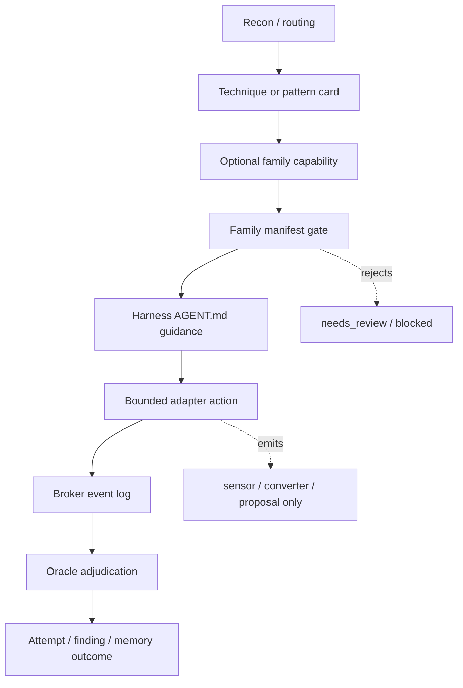

# Tool Family Adapter Architecture

**Status:** architecture proposal — no runtime build authorized\
**Date:** 2026-06-28\
**Related:** `engine/capabilities.md`, `capabilities/registry.yaml`,
`capabilities/classes.yaml`, `docs/decisions/0004-epistemic-autonomy-complexity-budget.md`

## Executive decision

The harness should adopt large external red-team toolkits as **tool families**, not as one-off skills and
not as raw agent toolboxes.

That means each family gets:

- a harness-owned profile of what the upstream repo contains;
- a harness-owned `AGENT.md` that tells the researcher how to use the family safely;
- a manifest of allowed actions, staged/blocked-until actions, gates, output schemas, and authority
  limits;
- one or more subprocess adapters that expose only the manifest actions;
- broker-owned evidence and oracle-owned adjudication.

The upstream repository remains a reference implementation. The harness owns the contract.

## Why this is needed

The first E-track pass correctly exposed only small keyholes:

- P4RS3LT0NGV3 as a converter;
- GLOSSOPETRAE as covert-channel encoding;
- ST3GG as steganography detection.

That was safe, but too shallow for long-term use. These repos are full tool families: transform catalogs,
agent-facing quickstarts, detection engines, encoders, analyzers, and in some cases payload construction
surfaces. A single card cannot capture that breadth.

The reframe is:

```text
not "call this upstream skill"
not "blindly vendor the upstream repo and call it integration"
not "let the model browse all tools"

but:

routing activates a harness technique
  -> technique recommends a family capability
  -> family AGENT.md explains the allowed operation
  -> manifest gate checks scope / class / allowed action
  -> adapter runs one bounded action
  -> broker records evidence
  -> oracle adjudicates
```

## Non-negotiable invariants

1. **External tools are never oracles.** They emit transformed canaries, artifact digests, decode
   evidence, proposals, or measurements. They never emit `confirmed`, `allow`, `verdict`, or `success`.
2. **Full-family adoption is inventory coverage plus staged authority.** The harness should understand
   the whole repo, including high-risk modules. The question is not "may this module exist?" but "which
   capability class may expose it, under which evidence gate?" Modules graduate through `sensor`,
   `converter`, `payload_generator`, and eventually brokered `executor` classes. None graduate to
   `oracle`.
3. **Upstream agent docs are reference, not policy.** Files such as upstream `SKILL.md` or
   `AGENT_QUICKSTART.md` are useful source material. The agent reads the harness-owned
   `tool-families/<id>/AGENT.md` during a run.
4. **License posture is explicit, not the main architecture gate.** The reviewed repos are AGPL-3.0.
   The default integration should stay arms-length because it is easier to test, replace, and keep out of
   the context window. If the operator intentionally accepts the license consequences, vendoring or
   deeper integration can be a deliberate implementation choice. That choice does **not** weaken the
   authority model: family code still cannot judge itself, mutate the evaluator, or bypass broker/oracle
   evidence.
5. **Raw corpora are handled as governed datasets, not context blobs.** Technique families may record
   abstract outcomes, transform ids, coverage classes, costs, and redacted evidence. Raw prompts,
   payloads, decoded data, live target ids, and secrets must not be casually loaded into model context or
   Plane 1/2 memory. If a corpus is intentionally adopted, it needs dataset provenance, risk tiers,
   scope gates, redaction rules, and evaluator-owned access.
6. **Broker evidence beats model claims.** A model may say "the transform worked"; the broker must show
   what was run, what controls ran, and what the target returned.

## Proposed directory shape

Future build phases should add family-owned docs and adapters under a stable shape:

```text
tool-families/
  glossopetrae/
    FAMILY.md          # static source review + module inventory
    AGENT.md           # harness-native quickstart for agents
    manifest.yaml      # allowed actions, classes, gates, output schemas
    fixtures/
    adapters/
  p4rs3lt0ngv3/
    FAMILY.md
    AGENT.md
    manifest.yaml
    fixtures/
    adapters/
  st3gg/
    FAMILY.md
    AGENT.md
    manifest.yaml
    fixtures/
    adapters/
```

This directory starts as a harness profile, not a vendored upstream copy. If a later phase deliberately
chooses a deeper AGPL-integrated route, keep the same boundary: vendored source may provide mechanisms,
but the manifest, broker, oracle, and conformance gates still provide authority.

## Family manifest contract

Each family manifest should be machine-checkable and should include:

| Field | Purpose |
| --- | --- |
| `family_id` | stable id, e.g. `glossopetrae` |
| `upstream` | repo URL, reviewed commit, license |
| `integration` | `subprocess`, `external_checkout`, `package_cli`, or `future_review` |
| `capabilities` | action groups mapped to `sensor`, `converter`, `payload_generator`, or future `executor` |
| `allowed_actions` | exact adapter actions the model may request |
| `blocked_until` | upstream actions that are in scope eventually but not exposed until named gates pass |
| `requires` | scope flags, `safe_signal`, containment, operator review |
| `output_schema` | JSON shape emitted by the adapter |
| `redaction` | fields that must be omitted, hashed, or summarized |
| `evidence_role` | how broker/oracle may use the output |

The manifest should fail closed if an action is not explicitly listed.

## Runtime flow



Important: `AGENT.md` guides the model, but the manifest and broker enforce authority.

## Capability class mapping

| Class | Tool-family meaning | Current status |
| --- | --- | --- |
| `sensor` | detect, inspect, summarize, classify an artifact as evidence | built as contract; runtime mostly deferred |
| `converter` | transform a benign canary or evidence sample | built for local toy converters; external runtime deferred |
| `payload_generator` | propose an artifact for an approved objective | contract + benign local generator built; external runtime deferred |
| `executor` | perform a live action against a target | buildable after brokered executor contract + scoped dry-run |
| `oracle` | decide truth | not assignable to external tool families |

## Module graduation ladder

Every upstream module can be inventoried now. It earns runtime authority only by passing the next gate.
This is the feedback loop future `/goal` prompts should use.

| Gate | What advances | Required proof before next gate |
| --- | --- | --- |
| **M0 — inventory** | module is documented in `FAMILY.md` | source path, purpose, inputs/outputs, risk tier, and proposed class recorded |
| **M1 — manifest** | module becomes a declared action | conformance rejects bad authority, missing scope gates, verdict leakage, and blocked-until misuse |
| **M2 — inert fixture** | module output schema exists | valid fixture passes; malformed/raw-secret/verdict fixtures fail |
| **M3 — hermetic adapter** | module runs against fake/local data | no live target; bounded output; cleanup; broker proves output is evidence/proposal only |
| **M4 — brokered dry-run** | module participates in a local engagement | signed local scope; controls + replay; proposal/execution/verdict split is visible in the ledger |
| **M5 — scoped live shadow** | module runs in an authorized engagement | scope-as-code; no autonomous severity escalation; operator-visible evidence bundle; no auto-promotion |
| **M6 — autonomous eligibility** | module may be selected by routing without case-by-case human choice | zero invalid accepts on false-discovery corpus; 3/3 replay where applicable; budget and cleanup invariants pass |

Failure at any gate produces `block` or `probe`, never a degraded best-effort run. The module can be
improved and retried, but it does not skip a gate because the upstream repo supports the action.

## Advancement rule for future worktrees

Each future `/goal` should implement **one family phase at a time** unless the phase document explicitly
groups them. To advance from one phase to the next, the agent must produce:

1. the intended files only, with unrelated working-tree changes untouched;
2. a short phase report naming what was built and what was not built;
3. a failing-to-passing fixture, self-test, or hermetic run proving the new gate bites;
4. conformance green;
5. `git diff --check` clean;
6. secret/client-name scan clean on touched files;
7. no new authority path where a tool output can become a verdict.

If any item is missing, the phase stops at `probe` or `block`. The next phase is not allowed to start in
the same run unless the plan explicitly says it may.

## What agents should read

In a future run, the orchestrator should read:

1. engagement `scope.md`;
2. active technique/pattern card;
3. `tool-families/<family>/AGENT.md` for the selected family only;
4. the adapter output schema if needed.

It should not load an entire upstream quickstart, README, examples folder, or raw prompt catalog into
context during normal operation. If a raw catalog is intentionally adopted, access is mediated through a
dataset/tool action with risk tiers and retrieval limits, not pasted wholesale into the prompt.

## Worked example: GLOSSOPETRAE as a channel family

1. Recon observes that a target has separate surface moderation before model processing.
2. Routing activates `covert-channel-encoding`.
3. The card recommends `external.gloss.channels`.
4. The family gate checks:
   - signed scope;
   - `safe_signal`;
   - adversarial input transforms allowed;
   - action is `encode_benign`;
   - objective is a benign canary.
5. The GLOSS adapter encodes `benign-preamble-canary` through a selected channel and emits:
   `channel_id`, `encoded_artifact_ref`, `decode_evidence`, `cost`, and `redaction`.
6. The broker sends the artifact to the target only if the engagement permits it.
7. The oracle checks whether the target acted on the canary, refused it, ignored it, or required review.

The GLOSS adapter never says "bypass confirmed." It only supplies a channel and evidence.

## Worked example: ST3GG as a detection family

1. A live engagement exports an image attachment or model-generated file.
2. Routing activates a steganography / indirect-prompt-injection concern.
3. The card recommends `external.st3gg.detect`.
4. The adapter runs a bounded analysis action on a local copy and emits a redacted artifact digest:
   file type, suspicious indicators, detector ids, confidence, and raw-payload-present boolean.
5. Raw extracted payloads are not stored in Plane 1/2. If extraction is necessary, the run writes only a
   hashed or canary-matched result unless the engagement scope explicitly authorizes more.
6. The oracle treats the digest as evidence for "artifact contains hidden data," not as proof of impact.

## Worked example: P4RS3LT0NGV3 as a transform catalog

1. A technique wants to test whether a target normalizes Unicode, base encodings, or format mutations.
2. The card recommends `external.p4.transform`.
3. The adapter lists or inspects transforms, chooses a small approved set, and converts a benign canary.
4. The broker records exactly which transform and options were used.
5. The oracle compares target behavior across plaintext, transformed, negative control, and replay.

P4 is the catalog; the harness supplies the scientific method.

## Advanced-module progression gates

The following are **in scope to build**, but not as first-step raw tools:

- upstream `agent`, `promptcraft`, `anticlassifier`, tokenade, fuzzer, jailbreak-template, injector, and
  conceal modes;
- `exploit_poc`, `chain_candidate`, or `zone2` payload classes;
- live executors;
- raw decoded payload handling;
- deeper vendored/integrated AGPL source;
- daemons, databases, browsers, or network services.

They advance through the module graduation ladder above. The permanent non-negotiables are narrower:

- no family module may select its own oracle or score itself;
- no module may mutate evaluator, gold, budgets, sealed data, or promotion authority;
- no live or persistent artifact may bypass scope, containment, cleanup, and broker evidence;
- no result may be called confirmed unless the harness oracle confirms it from broker-owned evidence.

## Source review performed

Static review only; no upstream code was executed.

| Family | Upstream | Reviewed commit | License observed |
| --- | --- | --- | --- |
| GLOSSOPETRAE | <https://github.com/elder-plinius/GLOSSOPETRAE> | `2c6f59a` | AGPL-3.0 — acceptable if deliberately adopted |
| P4RS3LT0NGV3 | <https://github.com/elder-plinius/P4RS3LT0NGV3> | `a6cb7c9` | AGPL-3.0 — acceptable if deliberately adopted |
| ST3GG | <https://github.com/elder-plinius/ST3GG> | `35f8b2b` | AGPL-3.0 — acceptable if deliberately adopted |
